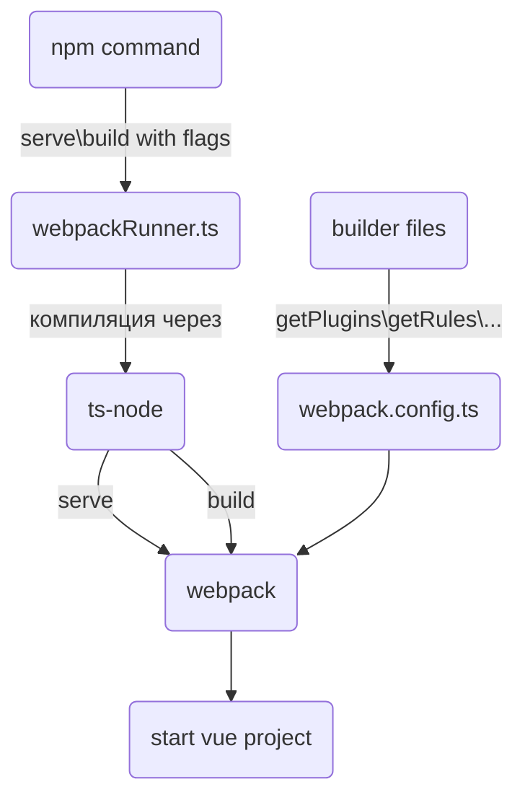

# iam-frontend

Запуск проекта:
```
$ npm ci
$ npm run serve
```

## Аргументы запуска
аргумент | alias | default value | описание
---------|-------|---------------|---------
mode | m | production | опциональный параметр режима сборки `production` или `development`
analyze| a | false | параметр подключения `WebpackBundleAnalyzerPlugin`

## Используемые технологии:
- vue v3 (options-api)
- webpack v5
  - esbuild-loader v2
- typescript v5.7.3
- sass\scss v1.83.1
- eslint v8
- postcss v8
  - autoprefixer v10.4

---

## Структура выполнения проекта


---

## Структура проекта
- Папка [builder](#builder) - конфиг для webpack и сопутствующие модули
- Папка src - дефолтная папка для проекта

---

### Builder
Файлы:
- [webpack.config](builder/webpack.config.ts) - результирующий конфиг для webpack
- [getDevServerConfig](builder/getDevServerConfig.ts) - конфигуратор для dev server
- [getPlugins](builder/getPlugins.ts) - конфигуратор для плагинов
- [getRules](builder/getRules.ts) - конфигуратор для правил сборки

**Транспилятор**<br>
В качестве транспилятора ts и минификатора использован [esbuild](https://esbuild.github.io) (альтернатива babel и terser),
данное решение было принято ненадобностью поддерживать старые бразуеры (в которые esbuild не может транспилить)
и значительной скоростью сборки относительно babel.

**css и препроцессор**<br>
В качестве препроцессора использован sass\scss с утилитой postcss([конфиг](postcss.config.js)).<br>
В postcss настроено 2 плагина:
- [autoprefixer](https://github.com/postcss/autoprefixer) - плагин для добавление префиксов вендоров
---

## Работа с цветовой палитрой
В проекте используется цветовая палитра, определённая в `src/assets/scss/variables/colors.scss`. Если в каком-то месте
нужно использовать цвет, то их стоит брать из указанного файла. Файл автоматически импортируется во все vue-компоненты,
поэтому его импорт в компонентах дописывать не нужно, достаточно просто вызвать переменную. В случае, если нужен цвет,
который отсутствует в палитре, нужно его добавить по следующей схеме:

1. Добавить определение переменной в `src/assets/scss/variables/colors.scss`;
1. Перегенерировать файлы декларации для TypeScript для этих переменных выполнением команды 
`npm run gen:scss-declaration` или `npm run serve:gen`;
1. Добавить в git сгенерированные файлы.

Все, кроме первого пункта, нужно для того, чтобы можно было использовать цветовые scss-переменные в JS/TS следующим
образом (здесь `@modules` - алиас для папки `src/assets/scss/modules`):
```typescript
import colors from '@modules/colors.module.scss';

console.log(colors.mSimpleText); // выведет значение цветовой переменной mSimpleText

## Guides and best practice

### Работа с универсальными компонентами
- [использование](#использование)
- [разработка](#разработка)

#### **Использование**
Базовые компоненты начинаются с суфикса `v`. Есть алиас для быстрого доступа `@ui/...`.

#### **Разработка**
Папка для создания `src/components/common`, инструкция:
- создать папку с названием вашего компонента в PascalCase
- создать файл с названием вашего компонента в PascalCase c префиксом `V`
(у некоторых компонентов префикс можно опустить)
- создать файл типов с названием `type.ts`
- создать файл `enums.ts` (если нужно) 
- создать файл `index.ts` и экспортировать все модули (компонент должен быть `export default`)
- создать файл README.md (если нужно) и описать там базовое использование компонента с пропсами и слотами
- 

Структура папки:
```
- VComponent - папка названия компонента
  - VComponent.vue - реализация компонента
  - types.ts - типы для компонента
  - enums.ts - енамы для компонента
  - index.ts - импорт компонента
```
```ts
// index.ts
import VComponent from './VComponent.vue';

export default VComponent;
export * from './types.ts';
```

Для того, что бы доступ стал одноуровневым:
```ts
import VComponent from '@ui/VComponent';
import type { VComponentProps } from '@ui/VComponent'
```
